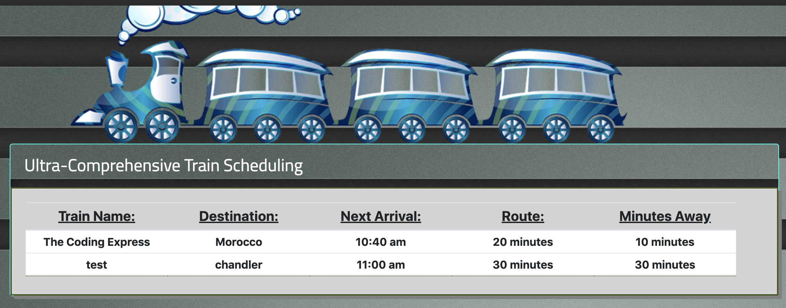

# Train Scheduler

## Creating Dynamic Tables with information from a Firebase database.

### Demonstrating HTML Tables created on the fly using information retrieved from a Firebase source. User can submit their own train that they want to track and view its' E.T.A. using time conversions coded with the Moment NPM package.

### This project is meant to show the steps from form capture to database storage/retrieval, and organized display with conversions. 

## Most importantly, this is my first project designed to move away from local storage and have the ability to submit a train from a desktop computer and monitor it on your phone on-the-go. 

